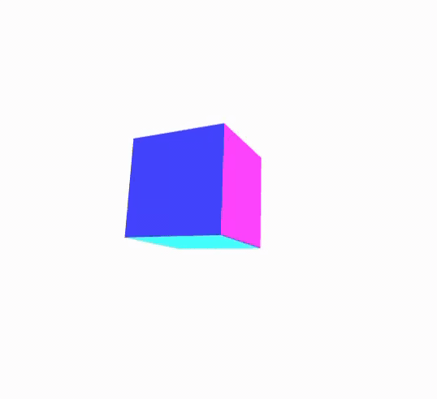

# WebGL Spinning Cube

After a few years of three.js, I wanted to dive deeper. This was my first attempts at raw webgl.
A from-scratch WebGL cube with model/view/projection matrices, no libraries.

- Raw WebGL setup (shaders, buffers, attributes, uniforms)
- Hand-rolled matrix math (translate, rotate, scale, perspective, lookAt)
- Orbiting camera using a proper lookAt function
- Per-face colors via vertex attributes
